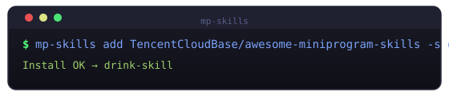
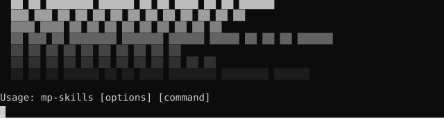

# mp-skills

<p align="center">
  
</p>

<p align="center">
  <a href="https://www.npmjs.com/package/mp-skills"></a>&nbsp;
  <a href="https://www.npmjs.com/package/mp-skills"></a>&nbsp;
  <a href="https://github.com/TencentCloudBase/mp-skills/blob/main/LICENSE"></a>&nbsp;
  <a href="https://nodejs.org/"></a>
</p>

<p align="center">
  
</p>

让小程序快速接入微信 AI 开发模式——通过安装现成的业务 Skill（咖啡点单、医院挂号、出行打车等），快速为用户提供 AI 驱动的对话式服务体验。支持快速创建新的 AI 小程序和 Skill，或将现有小程序改造为支持 AI 开发模式，并提供评测校验工具保障质量。

> [微信 AI 开发模式官方文档](https://developers.weixin.qq.com/miniprogram/dev/ai/guide.html)

---


## 快速开始
### 发现并安装 Skill

```bash
# 1️⃣ 先搜索看看有哪些可用 Skill
npx mp-skills find

# 2️⃣ 交互式选择并安装 Skill
npx mp-skills add TencentCloudBase/awesome-miniprogram-skills

# 3️⃣ 或直接安装指定 Skill
npx mp-skills add TencentCloudBase/awesome-miniprogram-skills -s <name>

# 4️⃣ 一键安装所有
npx mp-skills add TencentCloudBase/awesome-miniprogram-skills --all
```

命令需要在**小程序项目根目录**下执行（含 `project.config.json`）。安装后自动：

- 拷贝 Skill 到 `miniprogram/skills/<name>/`
- 更新 `miniprogram/app.json` 的 `agent.skills` + `subPackages`
- 更新 `project.config.json` 的 `packOptions.include`
- 写入 `skills-lock.json` 版本锁

### 环境搭建

安装 Skill 后，若有云开发依赖，运行一站式环境搭建：

```bash
npx mp-skills setup
```

`setup` 会聚合云函数、创建数据库集合、检查所需服务，让项目快速就绪。

---


## 命令

| 命令         | 描述                                                       | 层级 |
| ------------ | ---------------------------------------------------------- | ---- |
| `add`        | 从注册表/GitHub/URL/本地路径安装 Skill                     | ③ |
| `find`       | 搜索远程仓库中的可用 Skill                                 | ③ |
| `list`       | 列出已安装的 Skill                                         | ③ |
| `remove`     | 移除已安装的 Skill                                         | ③ |
| `update`     | 检查并更新已安装的 Skill                                   | ③ |
| `create`     | 在已有项目中创建新的 Skill 骨架                            | ② |
| `new`        | 创建新的小程序项目骨架                                     | ② |
| `validate`   | 对项目中 Skills 进行静态校验                               | ② |
| `execute`    | 执行 Skill 的原子接口                                     | ② |
| `render`     | 渲染 Skill 的原子组件                                     | ② |
| `setup`      | 一站式环境搭建：聚合云函数、创建集合、检查服务             | ② |
| `eval`       | 对已有 Skills 项目启动端到端质量评估（需 wxa-skills-eval） | ② |

---

### add

从注册表、GitHub 仓库、URL 或本地路径安装 Skill 到当前项目。

```bash
# 从注册表（交互式选择 Skill）
npx mp-skills add awesome-miniprogram

# GitHub shorthand（指定单个 Skill）
npx mp-skills add TencentCloudBase/awesome-miniprogram-skills -s <name>

# 安装全部
npx mp-skills add TencentCloudBase/awesome-miniprogram-skills --all

# 本地路径
npx mp-skills add ./my-local-skill

# 跳过确认
npx mp-skills add TencentCloudBase/awesome-miniprogram-skills -s <name> -y
```

| 选项                   | 说明                                                       |
| ---------------------- | ---------------------------------------------------------- |
| `-s, --skill <name>`   | 安装指定的 Skill                                           |
| `--all`                | 安装仓库中所有 Skill                                       |
| `-y, --yes`            | 跳过确认提示                                               |

---

### find

跨注册仓库搜索可用的 Skill。不需要提前知道 Skill 来自哪个仓库，`find` 会自动查询所有注册源。

```bash
# 列出所有远程可用 Skill
npx mp-skills find

# 按关键词搜索（中英文均可）
npx mp-skills find 咖啡
npx mp-skills find payment
npx mp-skills find 挂号

# 搜索到后可以直接用 add 安装
npx mp-skills add TencentCloudBase/awesome-miniprogram-skills -s <name>
```

发现 Skill → 安装 Skill → 环境搭建，三步搞定。

---

### list

列出当前项目已安装的 Skill。

```bash
# 列出已安装
npx mp-skills list

# 列出远程可用的
npx mp-skills list --remote

# 同时列出已安装和远程
npx mp-skills list --all
```

| 选项            | 说明                         |
| --------------- | ---------------------------- |
| `-r, --remote`  | 列出远程可用的 Skill         |
| `--all`         | 同时列出已安装和远程         |

---

### remove

移除已安装的 Skill。

```bash
npx mp-skills remove <name>
npx mp-skills remove --all
npx mp-skills remove <name> -y
```

| 选项        | 说明               |
| ----------- | ------------------ |
| `--all`     | 移除全部 Skill     |
| `-y, --yes` | 跳过确认           |

---

### update

检查已安装 Skill 是否有更新。

```bash
# 检查所有
npx mp-skills update

# 检查指定
npx mp-skills update <name1> <name2>
```

---

### new

创建一个新的小程序项目，含 AI Skill 支持的基础配置。

```bash
npx mp-skills new my-app
cd my-app
npx mp-skills add TencentCloudBase/awesome-miniprogram-skills -s <name>
```

---

### create

在当前小程序项目中创建一个新的 Skill。**默认走本地模板复制**；`--mode agent` 时调用 [opencode](https://github.com/sst/opencode) 让大模型分析项目并生成符合规范的 Skill 分包。

```bash
# 模板模式：拷贝模板到 <miniprogramRoot>/skills/<name>/
cd ./my-miniprogram
npx mp-skills create my-skill

# 指定项目目录
npx mp-skills create my-skill -p ./my-miniprogram

# agent 模式：进入 opencode 多轮会话，生成并自校验
npx mp-skills create my-skill --mode agent \
  -s "咖啡点单、订单管理"

# agent 模式 + 在已有 Skill 上迭代（同名再跑一次即可，agent 会做增量修改）
npx mp-skills create my-skill --mode agent \
  -q "createOrder 接口缺少 amount 字段"

# agent 模式 + 不指定 name：扫描整个项目，agent 自决要生成哪些 Skill
npx mp-skills create --mode agent
```

| 选项                    | 说明                                                                 |
| ----------------------- | -------------------------------------------------------------------- |
| `-p, --project <path>`  | 项目目录（默认当前目录）                                             |
| `--mode <mode>`         | 运行模式：`template`（默认，走模板）\| `agent`（大模型辅助生成）     |
| `-s, --scenario <desc>` | [agent] 业务场景描述，帮助模型聚焦（如：商品检索、订单管理）         |
| `-q, --query <text>`    | [agent] 本轮诉求；在已有产物上迭代时尤其有用                         |
| `--provider <name>`     | [agent] LLM 提供方预设（deepseek / glm / kimi / minimax）            |
| `-m, --model <name>`    | [agent] 模型名，覆盖 `--provider` 预设                               |
| `-e, --env <envId>`     | [agent] CloudBase 环境 ID（可选）                                    |
| `--non-interactive`     | [agent] 非交互模式：一次性跑完，适合脚本 / CI                        |

> agent 模式需要 `opencode-ai` + 一组 OpenAI 兼容凭据。详见下方「LLM 凭证」。

---

### setup

一站式环境搭建：聚合云函数、创建数据库集合、检查服务配置。

```bash
# 完整流程（云函数 + 数据库 + 服务检查）
npx mp-skills setup

# 仅处理云函数
npx mp-skills setup --cloud-functions

# 仅处理数据库
npx mp-skills setup --database

# 仅检查服务
npx mp-skills setup --services

# 预览模式，不实际执行
npx mp-skills setup --dry-run

# 指定云开发环境
npx mp-skills setup --env-id your-env-id
```

| 选项                       | 说明                                                   |
| -------------------------- | ------------------------------------------------------ |
| `-f, --cloud-functions`    | 仅处理云函数                                           |
| `-d, --database`           | 仅处理数据库                                           |
| `-s, --services`           | 仅检查服务                                             |
| `--dry-run`                | 预览模式，不实际执行                                   |
| `--env-id <id>`            | 云开发环境 ID（未指定则从项目配置读取）                 |

安装 Skill 后运行 `setup` 可自动完成所有云开发基础设施的部署。

---

### validate

对项目中 Skills 进行静态校验。

```bash
# 校验当前项目
npx mp-skills validate

# 校验指定项目
npx mp-skills validate ./path/to/project
```

---

### execute

执行 Skill 的原子接口。

```bash
npx mp-skills execute --name getDrinkList
npx mp-skills execute --name createOrder --args '{"drinkId":"123"}'
npx mp-skills execute --name getDrinkList --project ./path/to/project
```

| 选项                      | 说明                     |
| ------------------------- | ------------------------ |
| `-n, --name <api-name>`   | 接口名称（必填）         |
| `-a, --args <json>`       | JSON 格式参数            |
| `-p, --project <path>`    | 项目路径，默认当前目录   |

---

### render

渲染 Skill 的原子组件。

```bash
npx mp-skills render --name drinkList
npx mp-skills render --name drinkList --project ./path/to/project
```

| 选项                      | 说明                     |
| ------------------------- | ------------------------ |
| `-n, --name <api-name>`   | 接口名称（必填）         |
| `-p, --project <path>`    | 项目路径，默认当前目录   |

---

### eval

对**已安装 Skill 的**小程序项目启动端到端质量评估。需先安装 [wxa-skills-eval](https://github.com/wechat-miniprogram/ai-mode-skills)，并依赖微信开发者工具。

```bash
# 设置凭据
export WXA_SKILL_EVAL_LLM_BASE_URL=https://api.deepseek.com/v1
export WXA_SKILL_EVAL_LLM_API_KEY=sk-xxxx
export WXA_SKILL_EVAL_LLM_MODEL=deepseek-chat

# 默认 official 模式
npx mp-skills eval -c 3

# 使用 provider 预设
npx mp-skills eval --provider deepseek -m deepseek-v4-flash -c 3

# 指定项目目录
npx mp-skills eval -p ./my-miniprogram -c 3
```

| 选项                         | 说明                                                                                 |
| ---------------------------- | ------------------------------------------------------------------------------------ |
| `-p, --project <path>`       | 项目目录（默认当前目录）                                                             |
| `-e, --env <envId>`          | CloudBase 环境 ID。**BYOK 模式下可省略**——仅在需要透传给下游时填写                    |
| `-c, --cases <n>`            | 生成的测试用例数（默认 1）                                                           |
| `-s, --skill <name>`         | 只评估指定 Skill（默认评估全部）                                                     |
| `--headless`                 | 无界面模式，适合 CI 环境                                                             |
| `--mode <mode>`              | 评估模式，`official`（默认）或 `agent`                                               |
| `--provider <name>`          | LLM 提供方预设（deepseek / glm / kimi / minimax），预填 baseUrl 与默认 model         |
| `-m, --model <name>`         | 模型名，覆盖 `--provider` 预设与 `WXA_SKILL_EVAL_LLM_MODEL` 环境变量                 |
| `--openai-api-key <key>`     | OpenAI 兼容 API Key，覆盖对应环境变量                                                |
| `--openai-base-url <url>`    | OpenAI 兼容 Base URL，覆盖 `--provider` 预设与对应环境变量                           |

**两种评估模式**（实际评测都由官方 `wxa-skills-eval` CLI 执行）：

- `official`（默认）：mp-skills 直接拼好命令行调用官方 CLI，参数固定、可预期，适合 CI。
- `agent`：启动内置 coding agent（用 BYOK 凭证），让它读取 `wxa-skills-eval/SKILL.md` 后**自主调用官方 CLI** 发起评测，并按 SKILL.md 的续跑/排错指引自动重试。相比手敲命令更省心。

```bash
# agent 模式
npx mp-skills eval --mode agent -c 3
```

> 两种模式都依赖微信开发者工具（官方 CLI 的硬性要求）。

---

## LLM 凭证（BYOK）

`create --mode agent` 与 `eval` 共用**同一套** OpenAI 兼容凭证，通过环境变量配置：

```bash
export WXA_SKILL_EVAL_LLM_BASE_URL=<your-endpoint>
export WXA_SKILL_EVAL_LLM_API_KEY=<your-key>
export WXA_SKILL_EVAL_LLM_MODEL=<model-name>
```

运行前还会自动加载当前目录的 `.env`（不覆盖已显式 `export` 的变量）。

### 交互式向导

若运行 `create --mode agent` / `eval` 时**未配置任何凭证**且处于交互式终端（TTY），会弹出交互式向导让你选择提供方：

```
? 请选择 LLM 提供方：
  ❯ CloudBase（云开发 AI 网关，自动获取密钥）
    DeepSeek
    智谱 GLM
    Kimi（Moonshot）
    MiniMax
    自定义（手填 endpoint / key / model）
```

#### 提供方详解

**1. CloudBase（云开发 AI 网关）**

自动完成整套凭证配置，无需手动管理密钥：

1. **登录验证**：自动检测 CloudBase CLI 登录状态，未登录会提示先登录
2. **选择环境**：列出你的所有 CloudBase 环境，选择其中一个
3. **选择模型**：以表格形式展示可用模型（模型名、提供商、状态），已开启的排在前面的，未开启的会提示去控制台开通
4. **API Key 管理**：选择已有 API Key（自动获取明文）或新建一个

```
┌─────────────────────┬────────────┬──────────┐
│ 模型                │ 提供商     │ 状态     │
├─────────────────────┼────────────┼──────────┤
│ deepseek-v3         │ deepseek   │ 已开启   │
│ glm-4               │ zhipu      │ 已开启   │
│ moonshot-v1         │ moonshot   │ 未开启   │
└─────────────────────┴────────────┴──────────┘
```

完成后自动拼接出 CloudBase AI 网关的 OpenAI 兼容凭证（Base URL 含环境 ID 和模型路径）。

**2. 预设提供方**

内置了常用 LLM 提供方的端点和默认模型，只需填写 API Key 即可：

| 提供方          | 默认模型           | Base URL                              |
| --------------- | ------------------ | ------------------------------------- |
| DeepSeek        | `deepseek-v4-flash`| `https://api.deepseek.com/v1`         |
| 智谱 GLM        | `glm-5.1`         | `https://open.bigmodel.cn/api/paas/v4`|
| Kimi (Moonshot) | `kimi-k2.6`       | `https://api.moonshot.cn/v1`          |
| MiniMax         | `minimax-m2.7`    | `https://api.minimaxi.com/v1`         |

选择预设提供方后，只需输入：
- **API Key**（必填）
- **模型名**（可选，默认使用上表中的默认模型）

**3. 自定义**

完全手动填写 OpenAI 兼容接口的凭证：

- **Base URL**：如 `https://api.openai.com/v1`
- **API Key**（必填）
- **模型名**（必填）

### 凭证持久化

选完的凭证会写入当前目录的 `.env` 文件，下次运行时自动加载，不再弹出向导。

```bash
# 写入的 .env 示例
WXA_SKILL_EVAL_LLM_BASE_URL=https://api.deepseek.com/v1
WXA_SKILL_EVAL_LLM_API_KEY=sk-xxxx
WXA_SKILL_EVAL_LLM_MODEL=deepseek-v4-flash
```

> ⚠️ **安全提示**：`.env` 含明文密钥，请注意保管，建议加入 `.gitignore`：
> ```
> echo ".env" >> .gitignore
> ```

### 非交互式环境（CI）

在非交互式环境（如 CI/CD）下不会弹出向导，缺凭证时会打印所需环境变量并退出。需在运行前通过环境变量或 `.env` 文件配置好凭证。

### URL 规范化

`WXA_SKILL_EVAL_LLM_BASE_URL` 会自动规范化处理：

- 去掉末尾的 `/`
- 剥离 `/anthropic` 或 `/messages` 后缀
- 补上 `/v1` 路径

例如：
- `https://api.deepseek.com` → `https://api.deepseek.com/v1`
- `https://api.deepseek.com/anthropic` → `https://api.deepseek.com/v1`

只需配置一组凭证即可同时驱动 `create --mode agent`（opencode）和 `eval`（wxa-skills-eval）。

---

## add 做了什么

```
项目目录/
├── miniprogram/app.json      ← 自动注入 agent.skills + subPackages + lazyCodeLoading
├── project.config.json       ← 自动注入 packOptions.include
├── skills/<name>/            ← 拷贝 Skill 全套文件
│   ├── mcp.json              ← API Schema
│   ├── SKILL.md              ← 业务流程
│   ├── index.js              ← 注册入口
│   ├── apis/                 ← 原子接口
│   └── components/           ← 原子组件
├── skills-lock.json          ← 版本追踪
└── .deployed.json            ← 部署状态（云函数/数据库/服务跟踪）
```

---

## 安装

```bash
npm install -g mp-skills
# 或直接用 npx
npx mp-skills --help
```

---

## 从源码使用

```bash
git clone https://github.com/TencentCloudBase/mp-skills.git
cd mp-skills
npm install
npm run build
npm link
mp-skills --help
```

---

## 技术栈

- TypeScript + ESM
- [commander.js](https://github.com/tj/commander.js) — CLI 框架
- [opencode-ai](https://github.com/sst/opencode) — AI 模式 Skill 生成
- GitHub Trees API — 远程 Skill 发现（无需 git clone）
- `skills-lock.json` — 版本追踪 + 增量更新
- `@cloudbase/cli` — 云开发环境管理

---

## 相关链接

- [awesome-miniprogram-skills](https://github.com/TencentCloudBase/awesome-miniprogram-skills) — 完整 Skill 仓库
- [wechat-miniprogram/ai-mode-skills](https://github.com/wechat-miniprogram/ai-mode-skills) — 微信官方 Skill 示例
- [微信小程序 AI 开发模式文档](https://developers.weixin.qq.com/miniprogram/dev/ai/guide.html)

---

## 理解 mp-skills 的三层结构

这个仓库包含**三种不同类型**的东西，容易混淆，先理清楚：

### ③ 业务 Skill — 小程序里的 AI 能力

安装到小程序项目中，为用户提供具体的 AI 功能。

> 例子：queue-skill（排队取号）、order-skill（点餐）、payment-skill（支付）
>
> 安装方式：`npx mp-skills add TencentCloudBase/awesome-miniprogram-skills --skill queue-skill`

业务 Skill 存放在单独的 [awesome-miniprogram-skills](https://github.com/TencentCloudBase/awesome-miniprogram-skills) 仓库，本仓库不包含。

### ② CLI 工具 — 你直接用的命令行

管理业务 Skill 的安装、校验、评测和环境搭建。

> 例子：
> ```
> npx mp-skills find            # 搜索业务 Skill
> npx mp-skills add ...         # 安装
> npx mp-skills setup           # 初始化云开发环境
> npx mp-skills validate        # 校验业务 Skill 质量
> ```

### ① 工具 Skill — 给 AI 读的引导文档

本仓库 `skills/` 下的三个 SKILL.md 文件，**不安装到小程序中**。AI coding 工具读取后按步骤执行，帮你完成开发任务。

> 例子：
> - `wxa-find-skills` → AI 读完后知道怎么搜索安装业务 Skill
> - `wxa-create-ai-miniprogram` → AI 读完后知道怎么从零创建项目
> - `wxa-create-mp-skill` → AI 读完后知道怎么生成自定义 Skill 代码

安装方式（通过 skills.sh 安装给 AI coding 工具使用）：

```bash
# 安装全部
npx skills add TencentCloudBase/mp-skills --all

# 或安装指定 Skill
npx skills add TencentCloudBase/mp-skills -s wxa-find-skills
npx skills add TencentCloudBase/mp-skills -s wxa-create-ai-miniprogram
npx skills add TencentCloudBase/mp-skills -s wxa-create-mp-skill
```

也可在 [skills.sh](https://www.skills.sh/TencentCloudBase/mp-skills) 上查看。

也可通过 ClawHub 社区查看：

- https://clawhub.ai/binggg/wxa-find-skills
- https://clawhub.ai/binggg/wxa-create-ai-miniprogram
- https://clawhub.ai/binggg/wxa-create-mp-skill
